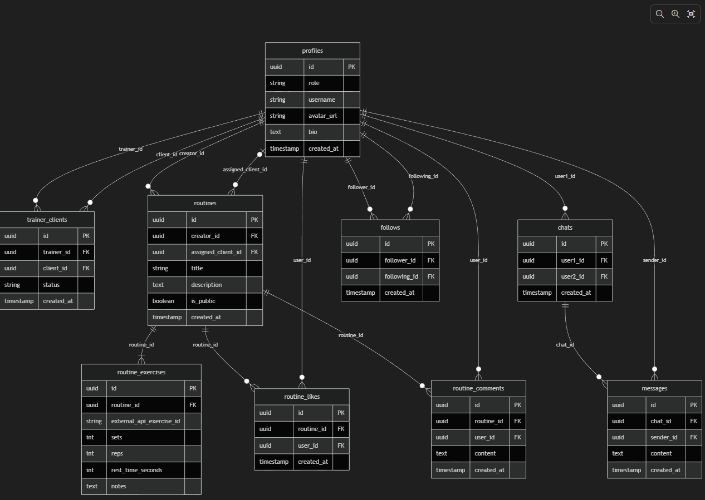

# FitLabs - Aplicación de Gestión de Entrenamientos


Una aplicación Flutter moderna pensada tanto para **entrenadores personales** como para **usuarios independientes**. Permite la gestión de clientes, creación de rutinas interactivas, comunicación por chat en tiempo real y cuenta con una capa de **red social** para compartir progreso, seguir a otros usuarios y dar "me gusta" o comentar rutinas.

## 📱 Características

### Pantallas Principales

- **🏠 Inicio (Resumen del Día)**
  - Dashboard con estadísticas del día
  - Entrenamientos próximos
  - Acciones rápidas (agregar cliente, crear rutina, etc.)
  - Banner de notificaciones

- **👥 Mis Clientes**
  - Lista de clientes activos
  - Estado de sesiones pendientes
  - Búsqueda y filtrado
  - Notificaciones de nuevos mensajes

- **📅 Calendario**
  - Vista de sesiones programadas
  - Gestión de horarios
  - Sistema de colores para diferentes tipos de entrenamientos

- **💬 Mensajes**
  - Chat con clientes
  - Historial de conversaciones
  - Notificaciones en tiempo real

- **👤 Perfil de Cliente**
  - Información detallada del cliente
  - Progreso de peso y métricas
  - Historial de sesiones
  - Calificaciones de rendimiento

- **📝 Crear Rutina**
  - Diseño de entrenamientos
  - Agregar ejercicios interactivos (vía API con animaciones/GIFs)
  - Configurar series, repeticiones y peso

- **🌐 Social y Usuarios Independientes (Nuevo)**
  - Explorar rutinas públicas en el feed social
  - Sistema de seguidores (Followers/Following)
  - Interacciones comunitarias: "Me gusta" (Likes) y Comentarios.

### Funcionalidades Técnicas

- ✅ Navegación con rutas nombradas (`/resumen`, `/clientes`, `/calendario`, `/mensajes`)
- ✅ Diseño responsivo y adaptativo
- ✅ Tema oscuro moderno
- ✅ Interfaz intuitiva con Material Design 3
- ✅ Animaciones suaves
- ✅ Badges y notificaciones

## 🎨 Diseño

### Paleta de Colores

```dart
// Gradiente principal
bgTop: #352B55 (Púrpura oscuro)
bgBottom: #1E1A2B (Casi negro)

// Acentos
accentRed: #FF3B30 (Rojo vibrante)
accentPurple: #6C63FF (Púrpura)
navBarColor: #332D43 (Gris oscuro)
```

### Tipografía

- **Fuente principal:** Roboto
- **Estilos:** Regular, Bold, SemiBold

## 📦 Estructura del Proyecto

```
lib/
├── main.dart                    # Punto de entrada y configuración de rutas
└── pantallas/
    ├── login.dart              # Pantalla de inicio de sesión
    ├── registrarse.dart        # Pantalla de registro
    ├── resumen_dia.dart        # Dashboard principal
    ├── mis_clientes.dart       # Lista de clientes
    ├── calendario_screen.dart  # Calendario de sesiones
    ├── mensajes_screen.dart    # Chat con clientes
    ├── detalle_cliente.dart    # Perfil del cliente
    └── crear_rutina.dart       # Editor de rutinas

assets/
├── fonts/
│   └── rubik_vinyl/            # Fuentes personalizadas
└── images/                      # Imágenes de la app
```

## 🚀 Instalación y Ejecución

### Requisitos Previos

- Flutter 3.x instalado
- Dart 3.x
- Android SDK (para compilar APK)
- Git

### Pasos de Instalación

1. **Clonar el repositorio**
   ```bash
   git clone https://github.com/CarlosFraidias/FitLabs_Flutter.git
   cd FitLabs_Flutter
   ```

2. **Instalar dependencias**
   ```bash
   flutter pub get
   ```

3. **Ejecutar la aplicación**
   ```bash
   flutter run
   ```

### Generar APK

```bash
flutter build apk --release
```

La APK se generará en: `build/app/outputs/flutter-apk/app-release.apk`

## 🏗️ Arquitectura

### Widget Structure

```
MaterialApp
├── LoginScreen
├── RegistrarseScreen
└── ClientsScreen (Navegación Principal)
    ├── ResumenDiaScreen
    ├── ClientsScreen
    ├── CalendarioScreen
    ├── MessagesScreen
    └── DetalleClienteScreen
```

### Estado de la App

- Cada pantalla mantiene su propio estado con `StatefulWidget`
- Índice de navegación (`_selectedIndex`) para rastrear la pantalla activa
- Navegación mediante rutas nombradas con `Navigator.pushNamed()`

## 🔧 Configuración

### Rutas Disponibles

```dart
routes: {
  '/login': (context) => const LoginScreen(),
  '/mensajes': (context) => const MensajesScreen(),
  '/resumen': (context) => const ResumenDiaScreen(),
  '/clientes': (context) => const MisClientesScreen(),
  '/calendario': (context) => const CalendarioScreen(),
  '/registrarse': (context) => const RegistrarseScreen(),
  '/crear-rutina': (context) => const CrearRutinaScreen(),
  '/detalle-cliente': (context) => const DetalleClienteScreen(),
}
```

### Tema de la Aplicación

```dart
ThemeData(
  fontFamily: 'Roboto',
  useMaterial3: true,
  brightness: Brightness.dark,
)
```

## 📝 Pantallas Detalladas

### 1. Resumen del Día
- Widget: `ResumenDiaScreen`
- Muestra: Sesiones realizadas, restantes, mensajes sin leer
- Acciones rápidas disponibles
- Lista de entrenamientos próximos

### 2. Mis Clientes
- Widget: `MisClientesScreen`
- Búsqueda en tiempo real
- Filtrado y ordenamiento
- Badges de notificaciones
- Iconos de acciones rápidas

### 3. Calendario
- Widget: `CalendarioScreen`
- Vista de sesiones programadas
- Gestión de horarios
- Interfaz intuitiva

### 4. Mensajes
- Widget: `MensajesScreen`
- Lista de chats recientes
- Búsqueda de conversaciones
- Notificaciones activas

### 5. Perfil del Cliente
- Widget: `DetalleClienteScreen`
- Información del cliente
- Gráficos de progreso
- Historial de sesiones
- Sistema de calificaciones

### 6. Crear Rutina
- Widget: `CrearRutinaScreen`
- Selector de cliente
- Agregar ejercicios
- Configurar series, reps y peso
- Guardar rutinas

## 🎯 Flujo de Navegación

```
Login → Registrarse → Resumen (Home)
                         ├── Mis Clientes
                         ├── Calendario
                         ├── Mensajes
                         └── Detalle Cliente
                             └── Crear Rutina
```

## 🔐 Seguridad y Datos

**Estado Actual:** Datos simulados en la app

### Arquitectura de Base de Datos

Hemos diseñado el siguiente modelo Entidad-Relación para la implementación con **Supabase (PostgreSQL)**:



**Próximas mejoras (Stack Elegido):**
- **Backend (Supabase):** Implementación de PostgreSQL para gestión de Perfiles con Roles, Relaciones Cliente-Entrenador, y el Feed Social.
- **APIs y Contenido:** Integración con **ExerciseDB (RapidAPI)** para mostrar una galería completa de ejercicios con instrucciones de texto y demostraciones visuales (GIFs).
- **Comunicación:** Chats nativos en tiempo real con Supabase Realtime.
- **Autenticación y Seguridad:** Supabase Auth (Email y Social Logins) junto al uso de RLS (Row Level Security) para proteger sesiones privadas.

## 🛠️ Desarrollo

### Dependencias Principales

```yaml
flutter:
  sdk: flutter

dev_dependencies:
  flutter_test:
    sdk: flutter
```

### Personalizar Colores

Edita los valores de color en cada pantalla:

```dart
final bgTop = const Color(0xFF352B55);
final accentRed = const Color(0xFFFF3B30);
```

## 📱 Especificaciones APK

- **Nombre:** FitLabs
- **Tamaño:** ~44.8 MB
- **Versión:** 1.0.0
- **Min SDK:** Android 16+
- **Target SDK:** Android 34+

## 🤝 Contribuciones

Para contribuir al proyecto:

1. Fork el repositorio
2. Crea una rama (`git checkout -b feature/AmazingFeature`)
3. Commit tus cambios (`git commit -m 'Add some AmazingFeature'`)
4. Push a la rama (`git push origin feature/AmazingFeature`)
5. Abre un Pull Request

## 📄 Licencia

Este proyecto está bajo la Licencia MIT. Ver el archivo `LICENSE` para más detalles.

## 👨‍💻 Autor

**Carlos Fraidías**
- GitHub: [@CarlosFraidias](https://github.com/CarlosFraidias)
- Repositorio: [FitLabs_Flutter](https://github.com/CarlosFraidias/FitLabs_Flutter)

## 📧 Contacto

Para preguntas o sugerencias, abre un issue en el repositorio.

## 🚀 Próximas Características

- [ ] Backend con Firebase
- [ ] Autenticación con Google/Apple
- [ ] Sistema de pagos
- [ ] Reportes avanzados
- [ ] Integración con redes sociales
- [ ] App para clientes
- [ ] Sistema de seguimiento GPS

## 📚 Recursos

- [Documentación Flutter](https://flutter.dev/docs)
- [Material Design 3](https://m3.material.io/)
- [Dart Language](https://dart.dev/)

---

**Última actualización:** 12 de febrero de 2026
**Estado:** En desarrollo activo ✅
